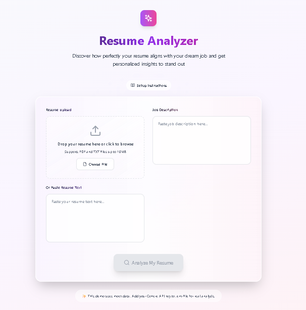

# Resume Analyzer


A React application that analyzes how well your resume matches a job description using AI-powered text analysis with Cohere.

## Features

- 📄 Upload PDF or TXT resume files
- 💼 Paste job descriptions
- 🤖 AI-powered analysis using Cohere API
- 🎯 Skills matching and suggestions
- 📊 Match score percentage
- 🌐 Deployable to GitHub Pages

## Demo

![Resume Analyzer Demo]

## Getting Started

### Prerequisites

- Node.js (v14 or higher)
- npm or yarn
- Cohere API key (optional, for real analysis)

### Installation

1. Clone the repository:
   ```bash
   git clone https://github.com/Harpreet-win/Resume-Analyzer.git
   cd Resume-Analyzer
   ```

2. Install dependencies:
   ```bash
   npm install
   ```

3. Create a `.env` file in the root directory and add your Cohere API key:
   ```env
   VITE_COHERE_API_KEY=your-cohere-api-key-here
   ```

4. Start the development server:
   ```bash
   npm run dev
   ```

5. Build for production:
   ```bash
   npm run build
   ```

## Usage

1. Upload your resume (PDF or TXT) or paste the text directly
2. Paste the job description you're applying for
3. Click "Analyze My Resume" to get your match analysis
4. Review the match score, present skills, missing skills, and improvement suggestions

## How It Works

The application uses Cohere's AI models to:
1. Extract embeddings from both your resume and the job description
2. Calculate cosine similarity to determine match score
3. Extract required skills from the job description
4. Identify which skills are present in your resume and which are missing
5. Generate personalized suggestions to improve your resume match

## Security

The Cohere API key is stored in the `.env` file, which is excluded from the repository via `.gitignore`. This ensures your API key is never exposed in the codebase.

## Demo Mode

If no API key is provided, the application will run in demo mode with mock data to showcase functionality.

## Technologies Used

- React with TypeScript
- Vite (build tool)
- Tailwind CSS (styling)
- Cohere AI API
- pdfjs-dist (PDF text extraction)

## Deployment

### GitHub Pages

This project is configured with a GitHub Actions workflow for automatic deployment to GitHub Pages:

1. Fork this repository
2. Go to Settings > Pages in your fork
3. Select "GitHub Actions" as the source
4. Push to your repository to trigger the deployment workflow

The application will be available at: `https://[your-github-username].github.io/Resume-Analyzer/`

### Other Hosting Services

You can deploy the built application (from the `dist` folder after running `npm run build`) to any static hosting service like:
- Vercel
- Netlify
- AWS S3

## Contributing

1. Fork the repository
2. Create your feature branch (`git checkout -b feature/AmazingFeature`)
3. Commit your changes (`git commit -m 'Add some AmazingFeature'`)
4. Push to the branch (`git push origin feature/AmazingFeature`)
5. Open a pull request

## License

This project is licensed under the MIT License - see the [LICENSE](LICENSE) file for details.

## Acknowledgments

- [Cohere](https://cohere.ai/) for providing the AI API
- [pdfjs-dist](https://mozilla.github.io/pdf.js/) for PDF text extraction
- [Vite](https://vitejs.dev/) for the build tool
- [Tailwind CSS](https://tailwindcss.com/) for styling


